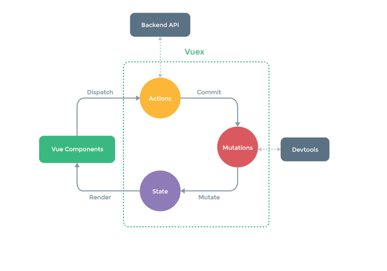

# Vue
::: tip
Vue提供了一套完整的解决方案(如双向数据绑定、组件化等)，它极大程度上的解放了程序员的双手让开发者更专注于业务逻辑而非DOM上的交互，它相比于React与Angular上手更加容易。 这也是很多初学者选择Vue的原因之一
:::

## 对于MVVM的理解
在说MVVM之前跟大家先说一下MVC吧
::: tip
MVC </br>
* Model(模型) 是应用程序中用于处理应用程序数据逻辑的部分，通常模型对象负责在数据库中存取数据 </br>
* View(视图) 是应用程序中处理数据显示的部分，通常视图是依据模型数据创建的 </br>
* Controller(控制器) 是应用程序中处理用户交互的部分，通常控制器负责从视图读取数据，控制用户输入，并向模型发送数据
:::
MVC在M和V进行通信时，C需要程序员书写大量业务逻辑代码，数据通信机制是单向的(M和V进行通信必须经过C的处理)。
::: tip
MVVM 是 Model-View-ViewModel 的缩写 </br>
* Model: 代表数据模型， 也可以在 Model 中定义数据修改和操作的业务逻辑。我们把Model称为数据层，因为它不关心任何行为仅仅关注数据本身</br>
* View: 用户操作界面。当 ViewModel 对 Model 进行更新的时候，会通过数据绑定更新到View</br>
* ViewModel: 业务逻辑层，View 需要什么数据，ViewModel 要提供这个数据； View 有某些操作， ViewModel 就要响应这些操作，所以可以说它是 Model for View
总结: MVVM模式简化了界面与业务的依赖，解决了数据频繁更新。MVVM 在使用中利用双向数据绑定使得 Model 层发生变化时 ViewModel 会自动更新，View 也会随着 ViewModel 的更新而更新
:::

## 常用的指令
* 差值表达式: 可以编译 `data` 的数据，也可以写一些简单的逻辑操作如二元运算三元表达式短路等
``` vue
  <template>
    <p>{{age}}岁</p>
    <p>{{flag ? '楼上18岁' : '楼上是个锤子的18'}}</p>
  </template>

  <script>
  export default {
    data () {
      return {
        age: '18',
        flag: true
      }
    }
  }
  </script>
```
* v-clock: 解决页面加载时出现 `data` 的变量名。当我们使用vue从后台读取的数据时或者是刷新页面的时候因为响应问题可能会闪现一下{{age}}
``` css
[v-clock] {
  display: none
}
```
``` html
<p v-clock>{{age}}</p>
```
* v-html: 更新元素的 `innerHTML`
* v-if和v-show: 条件渲染,值得注意的是

>使用了v-if的时候，如果值为 `false` ，那么页面将不会有这个 html 标签生成。</br>
>而v-show则是不管值为 `true` 还是 `false` ， html 元素都会存在，只是 CSS 中的 `display` 显示或隐藏

* v-for: 基于源数据多次渲染元素
* v-bind: 属性绑定。当表达式的值改变时，将其产生的连带影响，响应式地作用于 DOM 可以简写为':'
* v-on: 事件绑定。触发事件执行指定事件处理函数 可以简写为'@'
## Vue的生命周期
vue生命周期总共分为8个阶段: 创建前/后，载入前/后，更新前/后，销毁前/后。
* `beforeCreate` (创建前): 在实例初始化之后，此时组件的选项对象还未创建， `el` 和 `data` 并未初始化因此无法访问 `data` ，methods 等上的方法或数据
* `created` (创建后): 实例已经创建完成之后被调用，完成了 `data` 数据的初始化而 `el` 还暂时没有， `$el` 属性目前不可见
* `beforeMount` (载入前): 挂载开始之前被调用，相关的 `render` 函数首次被调用(虚拟DOM)，把 `data` 里面的数据和模板生成html，完成了 `el` 和 `data` 初始化但是此时还未挂载到html页面上
* `mounted` (载入后): 挂载完成，html模板已经渲染到html页面中，此时一般可以做一些axios的操作
* `beforeUpdate` (更新前): 在数据更新之前被调用，可以在该钩子中进一步地更改状态但不会触发附加地重渲染过程
* `updated` (更新后): 数据更新完成之后，调用时组件DOM已经更新。然而大多数情况下应该避免在此期间更改状态，因为这可能会导致更新无限循环
* `beforeDestroy` (销毁前): 在实例销毁之前调用，实例仍然完全可用(这一步还可以用this来获取实例)，此时我们可以做一些重置操作比如清除掉组件中的定时器和监听的dom事件
* `destroyed` (销毁后): 在实例销毁之后，调用后所有的事件监听器会被移出，所有的子实例也会被销毁
## Vue的双向数据绑定原理
vue.js是采用数据劫持结合发布者-订阅者模式的方式。
::: tip
在vue中所有 `data` 的属性都是通过 `Object.defineProperty()` 这个函数添加到 vue 实例上的，只要修改了 `data` 中的数据，必然会执行对应的 set 函数，在 set 函数中就可以进行视图的更新，视图数据发生变化影响模型只需要监听表单元素 value 。
:::
``` html
<div id="app">
  <input v-model="msg" />
  <h1 v-bind="msg"></h1>
</div>
```
``` js
let model = {
  msg: ''
}
const app = document.getElementById('app')
const models = app.querySelectorAll('[v-model=msg]')
const binds = app.querySelectorAll('[v-bind=msg]')
for (var i = 0; i < models.length; i++) {
  models[i].onkeyup = function() {
    model[this.getAttribute('v-model')] = this.value
  }
}
Object.defineProperty(model, 'msg', {
  get () {
    return this.value
  },
  set (val) {
    for (var i = 0; i < binds.length; i++) {
      binds[i].innerHTML = val
    }
    this.value = val
  }
})
```
## Vue3.0的双向数据绑定
Vue3.0使用的是 `Proxy` 这种方法实现数据劫持，首先来分析一下 `Object.defineProperty` 的问题
::: warning
1. 不能监听数组的变化
2. 必须遍历对象的每个属性
3. 必须深层遍历嵌套的对象
:::
使得实现起来比较复杂，而 `Proxy` 在ES2015规范中被正式加入，它有以下几个特点
1. 针对对象：针对整个对象，而不是对象的某个属性，所以也就不需要对 keys 进行遍历。
2. 支持数组：`Proxy` 不需要对数组的方法进行重载，减少代码量等于减少了维护成本，而且标准的就是最好的。
3. `Proxy` 作为新标准受到浏览器厂商的重点关注和性能优化，相比之下 `Object.defineProperty()` 是一个已有的老方法

## Vue的路由
Vue路由分两种，一种是 `hash` 模式另一种是 `history` 模式
### hash模式
在浏览器中符号'#'，# 以及 # 后面的字符称之为 `hash` ，用 `window.location.hash` 读取 </br>
所以有个很明显的特点在浏览器地址栏，url地址中会带有 # ，且可兼容低版本浏览器
* 实现原理: 监听 `hash` 的改变事件 `onhashchange` ，获取到 # 后面的 `hash` 值，然后和定义的路由规则进行匹配，匹配到后马上将对应组件渲染到页面，不会造成页面刷新 </br>
* 在 `hash` 模式下， 仅 `hash` 符号之前的内容会被包含在请求中，如 `http://www.xxx.com` 因此对于后端来说，即使没有做到对路由的全覆盖，也不会返回 404 错误
### history模式
`history` 采用 `HTML5` 的新特性；且提供了两个新方法：`pushState()` ，`replaceState()` 可以对浏览器历史记录栈进行修改，以及 `popState` 事件的监听到状态变更。</br>
在 `history` 模式下，前端的url必须和实际向后端发起请求的url一致，如 `http://www.xxx.com/items/id` 。后端如果缺少对 `/items/id` 的路由处理，将返回 404 错误。 `Vue-Router` 官网里如此描述：“不过这种模式要玩好，还需要后台配置支持......所以呢，你要在服务端增加一个覆盖所有情况的候选资源：如果 url 匹配不到任何静态资源，则应该返回同一个 `index.html` 页面”

## 组件之间的传值通信
组件之间通信有三种：父传子，子传父，非父子组件传值

### 父向子传值
使用 `props` ，父组件可以使用 `props` 向子组件传递数据。</br>
父组件：
``` vue
<template>
  <child :msg="message"></child>
</template>

<script>
import child from '@/views/...'
export default {
  components: {
    child
  },
  data () {
    return {
      message: '父传子'
    }
  }
}
</script>
```

子组件：
``` vue
<template>
  <div>{{msg}}</div>
</template>

<script>
export default {
  props: {
    msg: {
      type: String,
      default: ''
    }
  }
}
</script>
```

### 子向父传值
子组件：
``` vue
<template>
  <button @click="handleToFather">touch me</button>
</template>

<script>
export default {
  data () {
    return {
      msg: '子传父'
    }
  },
  methods () {
    handleToFather () {
      this.$emit('msgToDad', this.msg)
    }
  }
}
</script>
```

父组件：
``` vue
<template>
  <child @msgToDad="handleChild"></child>
</template>

<script>
import child from '@/views/...'
export default {
  components: {
    child
  },
  methods: {
    handleChild (msg) {
      console.log(msg)
    }
  }
}
</script>
```

### 3. 非父子组件之间通信
通过实例一个 vue 实例 `Bus` 作为媒介，要相互通信的兄弟组件之中，都引入 `Bus` ，然后通过分别调用 `Bus` 事件触发和监听来实现通信和参数传递。
``` js
import Vue from 'Vue'
export default new Vue
```

组件A：
``` vue
<script>
import Bus from '@/.../bus'
export default {
  data () {
    return {
      msg: '非父子传值'
    }
  }
  methods: {
    handleBrother () {
      Bus.$emit('getBrother', this.msg);  
    }
  }
}
</script>
```

组件B：
``` vue
<script>
import Bus from '@/.../bus'
export default {
  mounted: {
    Bus.$on('getBrother', val => {
      console.log(val)
    })
  }
}
</script>
```
这样就实现了非父子组件传值......但是到这儿后，一定要注意一个最容易忽视，又必然不能忘记的东西，那就是**清除事件总线eventBus** 。不手动清除，它是一直会存在的，这样的话，有个问题就是反复进入到接受数据的组件内操作获取数据，原本只执行一次的获取的操作将会有多次操作。如上我所举的例子，只是打印多次传过来的数据，但是我们日常开发中业务逻辑不仅仅只是简单的 `console` ，这样反复多次执行会有很大的性能消耗，所以得在 vue 生命周期 `beforeDestroy` 或者 `destroyed` 中用 vue 实例的 `$off` 方法清除 `eventBus`
``` vue
beforeDestroy () {
  Bus.$off('getBrother')
}
```

### provide/inject(这个用到的不多，知道即可)
根组件：
``` vue
<template>
  <div id="app">
    <router-view v-if="isActived" />
  </div>
</template>
<script>
export default {
  provide () {
    return {
      reload: this.reload
    }
  },
  methods: {
    data () {
      return {
        isActived: true
      }
    },
    reload () {
      this.isActived = false
      this.$nextTick(() => {
        this.isActived = true
      })
    }
  }
}
</script>
```
孙组件：
``` vue
<script>
export default {
  inject: ['reload'],
  mounted () {
    if (1 < 0) this.reload()
  }
}
</script>
```

## vuex
vuex是一个专为 Vue.js 应用程序开发的状态管理模式，说白了用于非父子组件之间传值的工具
### vuex是什么
1.  vuex 就是一个仓库，仓库里放了很多对象。其中 `state` 就是数据源存放地，对应于一般 vue 对象里面的 `data`
2.  `state` 里面存放的数据是响应式的，vue 组件从 store 读取数据，若是 store 中的数据发生改变，依赖这相数据的组件也会发生更新
3. 它通过 `mapState` 把全局的 `state` 和 `getters` 映射到当前组件的 `computed` 计算属性
### 怎么使用？
借助官方提供的一张图来说明

Vuex有5种属性: 分别是 `state` 、`getter` 、`mutation` 、`action` 、`module`
#### state(this.$store.state)
Vuex 使用单一状态树,即每个应用将仅仅包含一个 `store` 实例，但单一状态树和模块化并不冲突。存放的数据状态，不可以直接修改里面的数据。
#### mutations(this.$store.commit)
`mutations` 定义的方法动态修改 Vuex 的 `store` 中的状态或数据。
#### getters(this.$store.getters)
类似 vue 的计算属性，主要用来过滤一些数据
#### action(this.$store.dispath)
`actions` 可以理解为通过将 `mutations` 里面处里数据的方法变成可异步的处理数据的方法，简单的说就是异步操作数据。view 层通过 `store.dispath` 来分发 `action`。</br></br>
vuex 一般用于中大型 web 单页应用中对应用的状态进行管理，对于一些组件间关系较为简单的小型应用，使用 vuex 的必要性不是很大，因为完全可以用组件 `prop` 属性或者事件来完成父子组件之间的通信，vuex 更多地用于解决跨组件通信以及作为数据中心集中式存储数据
* 使用 vuex 解决非父子组件之间通信问题 </br>
vuex 是通过将 `state` 作为数据中心、各个组件共享 `state` 实现跨组件通信的，此时的数据完全独立于组件，因此将组件间共享的数据置于 `state` 中能有效解决多层级组件嵌套的跨组件通信问题。
* vuex 作为数据存储中心 </br>
vuex 的 `state` 在单页应用的开发中本身具有一个“数据库”的作用，可以将组件中用到的数据存储在 `state` 中，并在 `action` 中封装数据读写的逻辑。这时候存在一个问题，一般什么样的数据会放在 `state` 中呢？ 目前主要有两种数据会使用 vuex 进行管理：
  1. 组件之间全局共享的数据
  2. 通过后端异步请求的数据